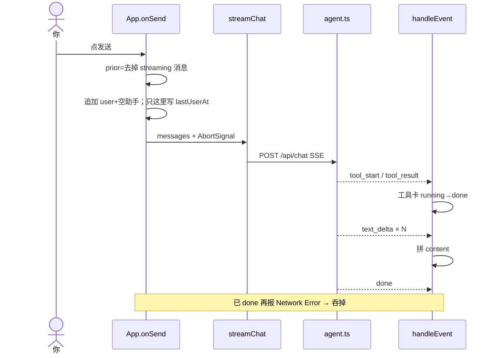

# 鱼皮 AI 训练营海报 × 本仓库对照缺口

> 用途：按海报模块标「已会 / 半懂 / 缺」，再按天补。不是报班清单。  
> 主战场：本仓库 `agent-chat-playground`。  
> 配套：`求职补充手册.md`（市场与简历）、`REPO_MAP.md`（代码导读）、`README.md`（90 秒演示）。

---

## 0. 怎么用这份表

1. 每天只做一个「缺口」+ 一份「口述 60 秒」。
2. 改代码前先在本文件把对应行勾掉或改状态。
3. 微调 / 训练 / 三套框架课（SpringAI / LangChain4j / 完整 FastAPI 重写）**默认不做**，除非目标岗 JD 明文要求。

状态图例：`✅ 已落地可讲` · `🟡 有代码但讲不深` · `⬜ 缺，本周可补` · `⏸ 刻意后置`

---

## 1. 第一阶段：概念速通 ↔ 仓库落点


| 海报模块                                 | 仓库里对应什么                                                                                         | 状态     | 你要补到什么程度                                             |
| ------------------------------------ | ----------------------------------------------------------------------------------------------- | ------ | ---------------------------------------------------- |
| 1 AI 理论（Transformer / GPT 演进）        | 无实现（正常）                                                                                         | ⏸      | 面试能画「自注意力一句话 + 预训练/SFT/RLHF 故事线」即可，不写代码              |
| 2 Prompt                             | `server/src/agent.ts` `buildSystemPrompt`；规则编号与 MCP/记忆抢号                                        | 🟡     | 能讲：系统提示结构、为何限制 README/MCP 长度、插话时 history 怎么过滤        |
| 3 RAG                                | `knowledge.ts` 切块 → `embed.ts` BGE → `retrieve.ts` hybrid/RRF/rerank → 引用 UI；`npm run eval:rag` | ✅ / 🟡 | **会跑评测、会解释 Recall vs MRR、会加一道黄金题**；缺的是「线上持续评测面板」     |
| 4 微调 LoRA                            | 无                                                                                               | ⏸      | 口述路径即可；本项目岗不靠训练                                      |
| 5 Agent（Tool / Memory / MCP / ReAct） | `agent.ts` 循环；`tools.ts`；`memory/`；`mcp.ts`；`codeTeam.ts` 多段                                    | ✅      | 能画一轮：模型选工具 → SSE 事件 → 卡片状态；MCP list→function calling |
| 6 开发框架（LangChain / Spring AI）        | **手写编排**，故意不绑框架                                                                                 | ⏸      | 简历写「自研 Agent 循环」；若 JD 要框架名，另开最小 toy，别重构本仓            |


---


## 2. 第二阶段：企业项目标签 ↔ 你已有 / 缺口

海报三个大项目拆成「能力标签」。只对照标签，不重做三个项目。


| 能力标签（海报）       | 本仓库                                            | 状态     | 缺口动作（可勾）                                                         |
| -------------- | ---------------------------------------------- | ------ | ---------------------------------------------------------------- |
| Tool Calling   | `tools.ts` + 前端 `ToolCard`                     | ✅      | [ ] 口述：工具 schema 谁注入、maxRounds 含义                                |
| SSE 流式         | `/api/chat` + `src/api/chat.ts`                | ✅      | [ ] 口述：done 后 Network Error 为何吞掉                                 |
| 写入人机门控         | `tool_approval` + `/api/chat/approve` + orphan | ✅      | [ ] 口述：热重载后批准如何不丢                                                |
| MCP            | `mcp.ts` + 配置页导入                               | ✅      | [ ] 真连一次公司/公开 MCP，录屏 30 秒                                        |
| ReAct / 多角色    | 默认 Agent 循环；`codeTeam` 四段；`delivery/` 产研泳道     | ✅ / 🟡 | [ ] 分清：对话「代码团队」≠ 交付页四身份（面试别混名）                                   |
| RAG + 混合检索     | `retrieve.ts` vector/hybrid/rerank             | ✅      | [ ] `npm run eval:rag` 截表进笔记                                     |
| 工作流编排          | `#/canvas` + `workflow.ts`（非 LangGraph）        | ✅      | [ ] 口述：人画 DAG vs Agent 自选工具的边界                                   |
| Skill          | `server/skills/*/SKILL.md` + `load_skill`      | ✅      | [ ] 口述：目录常驻、正文按需                                                 |
| 语义缓存（Redis）    | 仅有图片等本地 cache，**无问答语义缓存**                      | ⬜      | Day 3：内存/文件级「query 归一化 → 命中跳过检索」最小版                              |
| 异步任务队列         | 视频管线本地跑；**无 Celery**                           | ⏸      | 口述「为何本地文件队列够用」即可                                                 |
| 可观测（LangSmith） | 无；只有 console / 前端步骤                            | ⬜      | Day 4：每轮 chat 写一条 `server/data/traces/*.jsonl`（prompt 摘要、工具名、耗时） |
| 评测 RAGAS       | 自研 Recall@K / MRR（够用）                          | 🟡     | Day 2：加 1 道黄金题 + 记一次失败样例                                         |
| JWT + RBAC     | **无登录**（本地工作台）                                 | ⏸      | 投「企业知识库」岗再做；本仓库定位是本机                                             |
| Docker Compose | 无                                              | ⏸      | 有安装包/Electron 可替代「可交付」叙事                                         |
| 微服务 / Dubbo    | 无                                              | ⏸      | 不做                                                               |
| Serverless 部署  | 无                                              | ⏸      | 不做                                                               |
| PgVector       | 本地 JSON 向量文件                                   | 🟡     | 口述 tradeoff：可下载 vs 生产向量库                                         |


---


## 3. 第三阶段：面试突击（挂在本项目上）


| 题型          | 用本仓库怎么答                          | 准备动作                         |
| ----------- | -------------------------------- | ---------------------------- |
| RAG 四步      | 切块 → embed → hybrid → 生成+引用      | [ ] 指着 `retrieve.ts` 讲 RRF   |
| Agent 循环    | `runLive` maxRounds + tool 消息不跨轮 | [ ] 画一张序列图放笔记                |
| MCP vs 普通工具 | list 动态灌进 tools；失败 fail-open     | [ ] 对比 `tools.ts` 与 `mcp.ts` |
| 多 Agent     | codeTeam 白名单 vs delivery 闸门      | [ ] 各讲一个失败回退                 |
| 安全          | 工作区路径沙箱 + 写入批准 + 高风险仍拦           | [ ] 举 `.env` 为例              |
| 评测          | `eval:rag` Recall/MRR            | [ ] 能解释为何 rerank 抬 MRR       |


120 题库：按上面 6 类归桶刷，**不要按课名顺序刷**。

---


## 4. 七天执行表（每天 ≤3 小时）


### Day 1 — 口述主链路（不写大功能）

> **怎么看？** 跳到下文 **「§6 Day 1 怎么看」**，按 A→B→C→D。今天**不要**通读 REPO_MAP。

- [ ] A：发「现在几点了？」只看界面
- [ ] B：只读 4 处代码（`onSend` / `handleEvent` / `streamChat` / `agent.ts`）
- [ ] C：对着 §6 时序图讲一遍（含四个词）
- [ ] D：60 秒口述不卡

- **验收**：能说出「工具结果为何不算进用量环」（`toApiMessages` 只留 role+content）


### Day 2 — RAG 评测加深 ✅

> **已完成**。公司 wiki 全量索引 + 路径加权；`eval:rag` / `eval:online` hybrid·rerank **100%**。  
> vector 仍约 67%——生产不走裸向量。

**口述验收（念通即过）：**
> Recall@K 看答案在不在前 K；MRR 看排第几。页面手感差不等于检索差：检索是 A，模型会不会调 search_notes 是 B，答案/引用对不对是 C。`eval:rag` 只证明 A。

```bash
npm run eval:rag
npm run eval:online   # 与 search_notes 同链路
```

### Day 3 — 最小「检索语义缓存」

- [x] `retrieve` 入口：normalize(query) + 60s TTL 内存 Map（最多 64 条）
- [x] 命中打日志 `[rag] cache hit ...`；工具 JSON 带 `cache: hit|miss`
- [x] 索引更新时 `clearQueryCache()`
- **口述**：和海报 Redis 语义缓存差在——不持久、不跨进程、只做**字面归一化**精确命中，不做向量近似「意思相近也命中」

**验收：**
```bash
# 同一问连打两次，第二次应出现 cache hit，且明显更快
npx tsx -e '...'  # 或对话页连问两遍 AgentOS 那题，看 server 日志
```


### Day 4 — 最小 trace 落盘

- [ ] 每轮 chat `done` 时追加一行 JSONL：`session 粗 id、mode、工具名列表、耗时、是否报错`
- [ ] 路径建议：`server/data/traces/YYYYMMDD.jsonl`
- [ ] 口述：对照 LangSmith「缺 UI、有审计原料」

- **验收**：跑完一轮对话，文件里能看到对应行


### Day 5 — 代码团队 / 交付边界讲清

- [ ] 对照 `codeTeam.ts` 四段与 `delivery/roles.ts`，列「同名不同物」表
- [ ] 演示一次：对话开「代码团队」写文件批准；再演示 delivery 闸门
- [ ] 录 60 秒或写分镜脚本

- **验收**：别人听完不会以为是同一个功能


### Day 6 — MCP 真机 + 安全口头题

- [ ] `#/settings` 连一次 MCP（或 mock 讲通 list→call）
- [ ] 整理 5 道安全题答案：路径逃逸、批准超时/orphan、高风险文件、停止只断最新流、Key 不回显

- **验收**：5 题不卡壳


### Day 7 — 简历与 Demo 收口

- [ ] 按 `求职补充手册.md` 更新项目子弹（只写已验收能力）
- [ ] 跑一遍 README 90 秒路径；`npm run eval:rag` 原题不挂
- [ ] 勾掉本文件第二节所有「本周可补」项或改期

- **验收**：一份更新后的简历段落 + 一条可转发的演示说明

---


## 5. 明确不做（省时间）


| 海报吸引点                          | 为什么先不做                      |
| ------------------------------ | --------------------------- |
| 从零 SpringAI / LangChain4j 企业项目 | 你已有可讲的 TS 全栈；重复造轮子抢投递窗口     |
| 完整 FastAPI 知识库重写               | 同构能力已在 Express；除非转 Python 岗 |
| LoRA 实操                        | JD 多为应用层；概念口述够              |
| JWT/RBAC/微服务/Serverless        | 与「本机可下载工作台」产品定位冲突           |
| 把画布重写成 LangGraph               | 面试讲清「自研拓扑序」更加分              |


若某条 JD **明文**要其中一项，再单开一周专项，不要提前焦虑。

---


## 6. Day 1 怎么看（看不懂先读这里）


### Day 1 到底要干嘛？

**不写代码。** 目标只有一句：

> 别人问「用户点发送之后发生了什么」，你能按顺序讲完，中间不卡。

别一上来读整本 `REPO_MAP.md`。按下面 **A→B→C→D，约 30 分钟**。

---


### 步骤 A（5 分钟）— 先自己发一条看现象

1. 打开网页对话页。
2. 输入：`现在几点了？` 点发送。
3. 只记界面（能勾就勾）：
  - [ ] 立刻出现「我」的气泡
     [ ] 出现空的助手气泡，后来才填字
     [ ] 出现工具卡片（时间），跑 → 完
     [ ] 字是一段一段冒出来的
     [ ] 左边列表可能闪「生成中」

先有画面，再看代码。

---


### 步骤 B（15 分钟）— 只开这 4 处


| 顺序  | 文件                    | 搜什么                              | 一句话                                     |
| --- | --------------------- | -------------------------------- | --------------------------------------- |
| ①   | `src/App.tsx`         | `async function onSend`          | 先造「用户+空助手」两条消息，再调 `streamChat`          |
| ②   | `src/App.tsx`         | `function handleEvent`           | `text_delta` 拼字；`tool_*` 改工具卡；`done` 收尾 |
| ③   | `src/api/chat.ts`     | `streamChat`                     | POST `/api/chat`，边收 SSE 边 `onEvent`     |
| ④   | `server/src/agent.ts` | 文件头注释 + `runLive` / `streamMock` | 后端 Agent：模型可调工具 → 多轮 → 推 SSE            |


卡住再查 `REPO_MAP.md` 的 3.1（用量环）、3.2（`lastUserAt`）。**今天不通读全文。**

---


### 步骤 C（5 分钟）— 对着图讲，不用从零画




四个词必须能白话解释：


| 词               | 白话                               |
| --------------- | -------------------------------- |
| `lastUserAt`    | 你「提问」的时间；只有点发送才更新，吐字不改 → 左边列表不乱跳 |
| 过滤 `streaming`  | 半截回答别塞进下一轮 history，否则模型接着胡编      |
| `tool_approval` | 写文件先卡住等人批准                       |
| `doneRuns`      | 正常结束后误报网络错误就忽略                   |


---


### 步骤 D（5 分钟）— 验收稿（照着念也行）

> 点发送后，前端先塞用户消息和空助手消息，并记下 `lastUserAt`。再开 SSE。后端 Agent 可调工具，每次调工具前端画一张卡；正文用 `text_delta` 拼上；结束发 `done`。若已 `done` 还报 Network Error 就忽略。生成中再发时，会把还在 streaming 的助手消息从 history 剔掉。

---


### Day 1 完成标准

- [ ] 能按序说：造消息 → SSE → 工具卡/拼字 → done
- [ ] 能分清：`lastUserAt` 管列表排序，`updatedAt` 只管「最近动过」
- [ ] 能说清：为何发送要过滤 `streaming`

今天**不要**做 Day 2 评测、Day 3 缓存。

---


### 附：Day 2 口述（评测）

> 我们用黄金集测检索：每道题标好「该命中哪篇文档、片段里该有哪个字」。先跑 `npm run eval:rag`，对照 vector / hybrid / rerank。改之前有两道交付残留题，问句和标答无关，怎么调模型都过不了——先清脏数据。清完后 rerank 的 Recall@3 到 100%，MRR 约 0.91：说明答案都进了 Top3，但偶尔不是第一名。Recall 只看「在不在」，MRR 看「排第几」。

### 附：评测摸底（Day 2 前 → 后）

| 时机 | vector | hybrid | rerank |
|------|--------|--------|--------|
| 修脏题前 | 55% / 0.394 | 73% / 0.682 | 82% / 0.818 |
| 修脏题后 | 64% / 0.485 | 82% / 0.773 | **100% / 0.909** |
